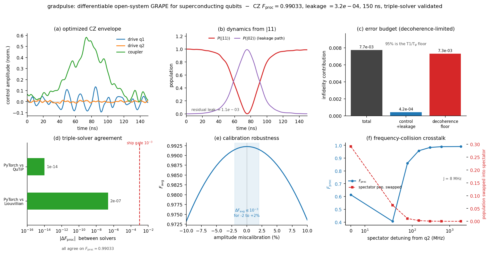
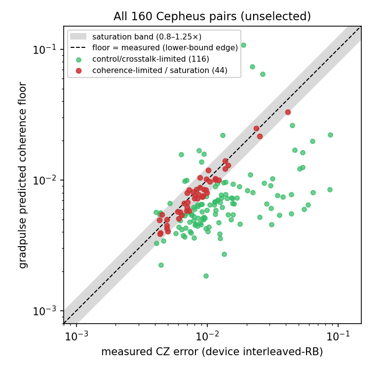
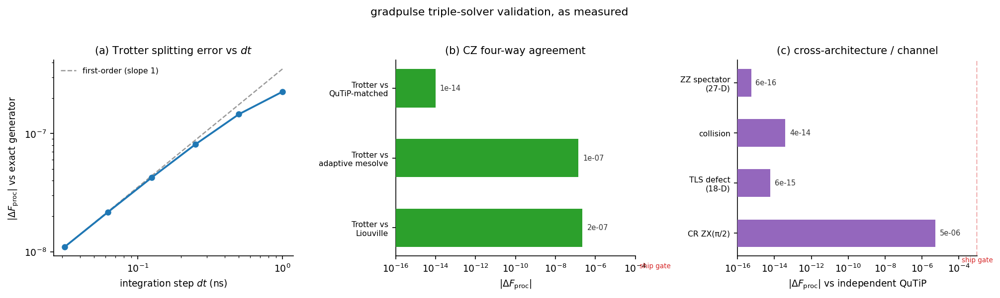

# gradpulse

[](#installation)
[](LICENSE)
[](https://github.com/PureStateLabs/gradpulse/actions)

**A differentiable, multi-solver-validated, open-system pulse optimizer for predictive superconducting-gate fidelities**

Give gradpulse a qubit pair (a generic profile or a real device's calibration) and a target gate. It finds the microwave and flux pulse that runs that gate, optimizing through a full open-system simulation: $T_1$ relaxation, $T_\phi$ dephasing, and leakage into higher transmon levels are all in the forward pass. The optimizer trades gate speed against decoherence as it shapes the pulse, so the pulse it returns is optimized against that noise rather than against a perfect simulation.

It also won't hand you a fidelity it can't back up. Every number gradpulse reports is reproduced by three solvers that share no code, and the underlying model reproduces the measured gate error of real, published devices.

Built and maintained by [Pure State Labs Inc.](https://purestatelabs.com)



*A 150 ns CZ gate: the optimized envelope, the |11⟩→|02⟩ leakage that creates the conditional phase, and the error budget, next to its validation (triple-solver agreement, robustness to amplitude miscalibration, and a near-resonant spectator collision).*

## Installation

> **Pre-release (v0.6.0, beta).** Not on PyPI yet, so install from source.

```bash
git clone https://github.com/PureStateLabs/gradpulse
cd gradpulse
pip install -e ".[validate,viz]"   # core + QuTiP cross-check + Matplotlib
```

Just the optimizer (PyTorch + NumPy): `pip install -e .`. For the hardware paths add `[braket]`, `[openpulse]`, or `[benchmark]`.

## Quickstart

```python
import gradpulse as gp
from gradpulse import viz

# A generic profile, or load a measured Braket/IBM QPU calibration
profile = gp.ParametricCouplerProfile()

result = gp.optimize_cz(profile)          # optimize a CZ
viz.plot_pulse(result)                    # the pulse
viz.plot_convergence(result)              # and how it got there

# Where does the error come from?
budget = result["optimizer"].error_budget(result["best_raw_param"])
print(f"control + leakage: {budget['r_control_leakage']:.2e}")
print(f"decoherence floor: {budget['r_decoherence']:.2e}")
print(f"channel unitarity: {budget['unitarity']:.6f}")
```

Check a saved pulse against QuTiP from the command line: `python -m gradpulse.validate --pulse cz_pulse.json`.

## Does it match real hardware?

gradpulse predicts a gate's **decoherence floor**: the error you would get if only $T_1$ and $T_2$ mattered. Real gates also carry control error, crosstalk, and non-Markovian noise, so the floor is a *lower bound* — it equals the measured error when a gate is coherence-limited and sits below it otherwise. That makes a clean, falsifiable claim: the floor should never exceed the measured error of a coherence-limited gate.

**Three published gates, three groups.** Each is a cited JSON file in [`examples/anchors/`](examples/anchors/); adding a fourth is data, not code (`python examples/validate_against_literature.py`).

| device | measured CZ error | gradpulse floor | ratio |
|---|---|---|---|
| Sung 2021, tunable coupler (*PRX* 11, 021058) | 2.4×10⁻³ | 2.4×10⁻³ | 0.99× |
| Marxer 2023, long coupler (*PRX Quantum* 4, 010314) | 1.9×10⁻³ | 1.9×10⁻³ | 1.01× |
| Stehlik 2021, parametric, pair 11 (*PRL* 127, 080505) | 4.9×10⁻³ | 5.1×10⁻³ | 1.05× |

Across all 11 Stehlik pairs the floor stays a lower bound (11/11, median 0.37×) and saturates only on pair 11, the most decoherence-pressured.

**A live 108-qubit chip.** Against Rigetti's Cepheus-1-108Q — measured interleaved-RB CZ fidelity and both qubits' $T_1$/$T_2$ for all 160 active pairs, with the real per-pair gate duration read from native calibration — the floor lands at or below the measured error on **150 of 160** pairs, median **0.66×** measured, with nothing fitted or selected (`python examples/cepheus_lowerbound_scatter.py`).



**We also ran it ourselves.** For one coherence-limited pair we pre-registered the floor (0.51%, fixed before submission) and ran our own interleaved-RB experiment on the device; the reference arm reproduces the prediction to **1.04×**.

The per-pair scatter, the in-measurement-error-bar (σ) analysis, the own-run details, and the calibration-drift caveats are in [RESULTS.md](RESULTS.md).

## Three independent solvers

A control simulation can be perfectly self-consistent and still wrong. gradpulse guards against that by routing every fidelity through three solvers that share no operator-construction or matrix-exponential code.

The PyTorch optimizer and a matched QuTiP integrator use the same Lie-Trotter step but build their operators and contractions independently. They agree to ~10⁻¹⁴, which catches transcription bugs (signs, collapse-rate normalization, basis ordering) but says nothing about the splitting error they have in common. Two more solvers pin that down: a dependency-free NumPy Liouvillian takes the exact exponential of the full generator, and QuTiP's `mesolve` runs an adaptive ODE. On the headline CZ all three meet at 2×10⁻⁷, the first-order Trotter error, which shrinks linearly in `dt`. Hold the pulse fixed, sub-step, and extrapolate `dt→0`, and the independent solvers converge to ~10⁻¹³ ([`tests/test_machine_precision.py`](tests/test_machine_precision.py)).

CI fails the build if any two solvers drift apart at the operating point. The three implementations live in [`parametric.py`](src/gradpulse/parametric.py), [`liouville.py`](src/gradpulse/liouville.py), and the QuTiP calls in [`validate.py`](src/gradpulse/validate.py), and you can fork any of them.



*(a) The Trotter error falls first-order toward the exact-generator value. (b) The matched integrator reproduces the optimizer to ~10⁻¹⁴; the adaptive solver and exact generator sit at ~10⁻⁷. (c) The same cross-check across a 27-D ZZ spectator, a resonant collision, an 18-D TLS defect, and cross-resonance ZX(π/2), all under the 10⁻³ ship threshold. Regenerate with `python examples/make_validation_figure.py`.*

## Benchmarks against other tools

The optimizer is benchmarked head-to-head against established packages on identical problems. On a matched closed-system GRAPE task it reaches the same optimum as `qutip-qtrl` at comparable wall-clock time, and on a single-qubit task it agrees with `c3-toolset` (with the portability caveat that its modern-stack open-system path needed workarounds). The point isn't a speed record — it's that an independent engine lands on the same answer (`python examples/benchmark_vs_qutip_qtrl.py`, `examples/benchmark_vs_c3.py`).

## Architectures

Four gate models. Each carries an independent QuTiP cross-check of its operators, and each of the three pair/register architectures also has a *library-independent* NumPy-only Liouvillian referee (`liouville_f_proc` / `liouville_cr_f_proc` / `liouville_nqubit_closed_f_proc`), so "three solvers sharing no code" holds architecture-wide, not just for the headline CZ.

1. **Parametric-coupler CZ.** Tunable transmons with a flux-activated coupler, dispersively eliminated, plus AC-Stark pre-compensation and a differentiable transmission-line response. This is the headline gate and the one the Cepheus validation tests.
2. **Explicit tunable coupler.** A 27-D open-system model that keeps the coupler as a live transmon (as on Rigetti and Google hardware), so coupler leakage is modeled instead of eliminated.
3. **Cross-resonance ZX.** Fixed-frequency transmons with always-on exchange, derived-quadrature DRAG, and echoed-CR sequences that refocus ZZ into a single-qubit term.
4. **General N-qubit register.** Arbitrary coupling graphs, optimizing a target gate on a subset while holding identity on the rest, so crosstalk and frequency collisions go *inside* the optimization. Disjoint subgraphs can be driven at once (parallel CZ), with sparse/Krylov propagation and MPS/TEBD trajectory unraveling once $N \geq 6$.

## Analysis and noise

A fidelity number is a starting point. The tools below take a gate's error apart and stress it, and all of them run in CI.

- **Error budgets:** split infidelity into a coherent control/leakage part and a decoherence floor, with channel unitarity computed independently as a check.
- **Crosstalk and collisions:** near-resonant frequency collisions, lossy two-level-system (TLS) defects, and always-on $ZZ$ between spectators.
- **Colored noise:** analytic dephasing filter functions $F(f)$, Monte-Carlo $1/f^\alpha$ sweeps with cross-qubit correlation, and finite-temperature bath jumps.
- **Spectral optimization:** synthesize pulses directly in a band-limited Fourier/CRAB basis instead of smoothing after the fact.
- **In-loop decoherence, measured:** a duration-swept head-to-head ([`headtohead`](src/gradpulse/headtohead.py)) against the usual shortcut of optimizing coherently and multiplying by $e^{-t_g/T}$. On a decoherence-pressured pair the shortcut over-predicts delivered fidelity; the in-loop objective reports what it actually delivers.
- **Leakage in the loop:** the companion crossover ([`leakage_in_the_loop.py`](examples/leakage_in_the_loop.py)): a duration-swept cross-resonance gate with each optimized gate's error split by `error_budget`. Slow gates are coherence-limited and the one-line coherence formula tracks the truth; fast gates turn leakage-limited, where coherent leakage dwarfs the decoherence floor and the formula badly under-predicts the true error. Every fidelity in the sweep is triple-solver checked.
- **Noise-robust objectives:** optimize against the quasi-static $1/f$ dephasing distribution directly (`robust_dephasing_sigma_mhz`), on the same Gauss-Hermite grid the scorer uses.
- **Hardware-in-the-loop calibration:** refine coherence parameters from finite-shot, leakage-aware interleaved-RB estimates.
- **Optimizer guards:** non-finite steps are caught, counted, and rolled back, so one diverging seed can't poison a multi-seed run.

## Hardware export

- **OpenPulse 3.0 / OpenQASM 3:** vendor-neutral export with the DRAG quadrature baked into the I/Q arrays, checked offline against an independent parser (`qiskit.pulse` was dropped in Qiskit 2.0).
- **Amazon Braket:** export to `PulseSequence` and `ArbitraryWaveform`, plus the native-calibration reader and per-shot cost arithmetic used in the Cepheus study. Only the final submission needs AWS credentials.
- **Interleaved RB:** generate native-transpiled, verbatim-boxed IRB circuits that benchmark either the device's native CZ (validates the model) or a gradpulse-designed pulse (tests the optimizer), with canary, cost, and online guards on submission ([`examples/cepheus/run_irb_on_braket.py`](examples/cepheus/run_irb_on_braket.py)). Everything up to `device.run()` is offline-verifiable.

## Scope

gradpulse is a simulator, and a focused one. Three limits to know before you lean on a number:

- **It predicts; it is not a closed-loop calibration tool.** The fidelities are simulated, cross-checked between solvers, and matched against measured coherence budgets on the devices above. gradpulse also designs and exports pulses, and one gradpulse CZ pulse has been played on Cepheus at canary depth (a `CZ_BENCH` pulse_gate accepted and executed inside the verbatim box). A full on-device fidelity is still unrun: an open-loop transfer scaled to the device's flux starts below the device's tuned native CZ until closed-loop calibration closes the gap, and Braket's local simulator runs gates rather than pulses, so the number genuinely needs the QPU.
- **The floor is a lower bound.** It equals a measured fidelity for coherence-limited gates and sits below otherwise. The analysis suite models the missing terms (control, crosstalk, structured noise), but none of them is a fitted correction back to a measured number.
- **Exact optimization stops around four qubits.** Density-matrix GRAPE is a workstation tool to ~4 qubits; the sparse and MPS paths push *evaluation*, not optimization, into larger weakly-entangling registers. gradpulse optimizes one entangling gate among its neighbors, not whole circuits.

## Documentation

| Resource | What's in it |
|---|---|
| [API_REFERENCE.md](API_REFERENCE.md) | Every public class, method, and function: signatures, return dicts, conventions, a customization cookbook. |
| [RESULTS.md](RESULTS.md) | The full hardware-validation log: device facts, the Cepheus sweep, the σ analysis, the own-run, and the triple-checks. |
| [examples/README.md](examples/README.md) | One runnable script per feature. |

## Citation

```bibtex
@software{gradpulse,
  author = {Pure State Labs Inc.},
  title  = {gradpulse: Gate-pulse optimization for superconducting qubits},
  year   = {2026},
  url    = {https://github.com/PureStateLabs/gradpulse},
}
```

## About

gradpulse is built and maintained by **[Pure State Labs Inc.](https://purestatelabs.com)**, quantum software and methods. Questions or collaboration: info@purestatelabs.com

## License

[MIT](LICENSE). © 2026 Pure State Labs Inc.
